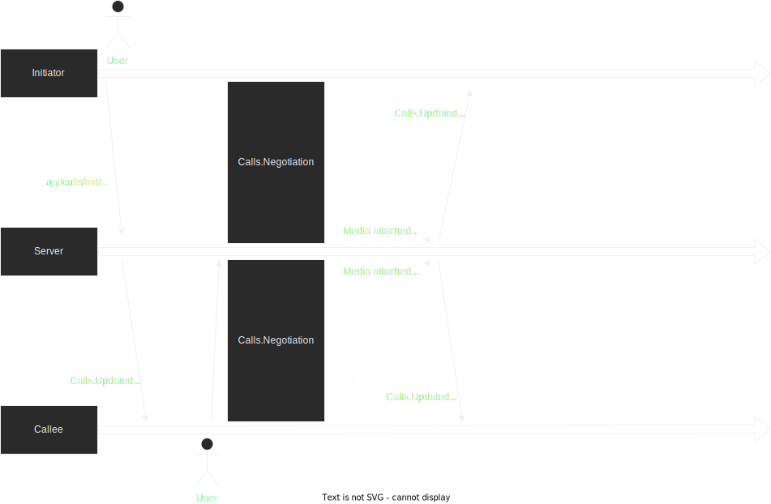

# WebRTC in a Blazor Application
Blazor Webassembly has no access to the Browser Api through C#. The WebRTC implementation built into modern browsers therefor has to be accessed through helper functions in Javascript.

## WebRTC
WebRTC is a highlevel api which allows managing a realtime connection between two clients in a peer 2 peer manner (a "direct" connection without a server, albeit a TURN server for forwarding is required in case NAT traversals prevent a direct connection). The browser apis implementation is specifically catering to video and audio transmitting, having built in support for the browsers MediaStream / MediaStreamTrack types.
## P2P Call Process
1. Request access to camera and audio:

    Any script wanting to utilise camera or microphone input has to request access from the browser and in extension the user. Some browsers do not expose the list of devices without this access.

    1. Request camera and microphone access
    1. Get the list of audio and video input devices
    1. The user chooses which inputs (if any) to activate
1. Configuring the RTC Peer connection
    1. Get a list of STUN / TURN configurations from the servers
    1. Attach Streams and configure the data channel
1. Establishing connection
    
    Set local/remote descriptions and Forward negotiation messages. [Useful Guide on the topic](https://developer.mozilla.org/en-US/docs/Web/API/WebRTC_API/Perfect_negotiation).

    Negotiation messages are transmitted between peers via the servers SignalR hub.

    
## Issues
* Whenever the browser Api is invoked from JS interop, promise rejections or other exceptions are not guaranteed to end up in the browser console (unlike .NET WASM exceptions). As a solution browser Api calls are wrapped in try catch blocks.
* There are instances where a browser api call simply never returns. As a solution calls to the browser api are raced against a 1 second timeout.
* RTCPeerConnection doesn't begin negotiating if there is no payload (track or datachannel) attached. A solution is to attach a datachannel by default (wether its actually used or not)
* There is no way of marking streams attached to a RTCPeerConnection
    * Stream Ids, Track Ids, Track labels sometimes are preserved, sometimes are not depending on the clients browser.
    * Changes to the Sdp string work with some browsers, but on other browsers they cause irrecoverable errors or are simply removed.

    As a consequence it is a big challenge to determine wether an incoming video stream is a camera or a screen capture. The final "solution" for this implementation was to just not label incoming streams in the UI.

## STUN/TURN

A [STUN](https://en.wikipedia.org/wiki/STUN) server is required for clients to discover their public Ip. Plenty of free services exist, such as `stun:stun.l.google.com:19302`. 

A [TURN](https://en.wikipedia.org/wiki/Traversal_Using_Relays_around_NAT) server is required for NAT traversal. For testing a free service such as [Viagenie NUMB](https://numb.viagenie.ca/) can be used, but for production a dedicated solution needs to be setup (for example [coturn](https://github.com/coturn/coturn)). Right now TURN credentials are fixed environment variables and therefor shipped as effectively plain text as part of the client application. In a production environment, temporary credentials should be generated dynamically and provided to the client only as needed.

## JS Interop for WebRTC
All the heavy lifting for WebRTC happens in the browser Api, accessed via Javascript. In this implementation, The clients service `WebRTCCallService` (`Client/Services/`) controls the scripts state. A global object `window.webRtcHelper` manages the RTCPeerConnection and active media streams. A global function object `window.queryDevices` is used to get a list of input devices usable for WebRTC.

Whenever a call is opened or accepted the Call service initiates the script-side webRtcHelper.

The JS side right now manages many aspects, such as matching tracks to video elements, configuring local RTCPeerConnection, performing negotiations, etc. An alternative approach could be to match a `RtcPeerConnection` type on C# Side, with calls to and from the javascript counterpart directly with most of the logic happening in C#.

## Data channel
A data channel is used to transmit the state of attached media to the other peer. The original intent was to allow identifying tracks to sources (camera vs. screen capture), but this was abandoned as not feasible (See [issues](#issues)). At this time all it does is notifying the other client about the state of input devices (microphone enabled? camera enabled? screenshare enabled?)

## Multiple Users
In theory, voice + video meetings could be enabled with more than two participants via peer 2 peer. However this requires a unique rtc peer connection per client for all other participants. This also requires transmitting outgoing streams for every other participant separately. This puts a lot of strain on both client hardware and network. Existing implementations therefor restrict the maximum number of participants in peer 2 peer calls between 3 - 4 with video and ~ 10 with audio only. 