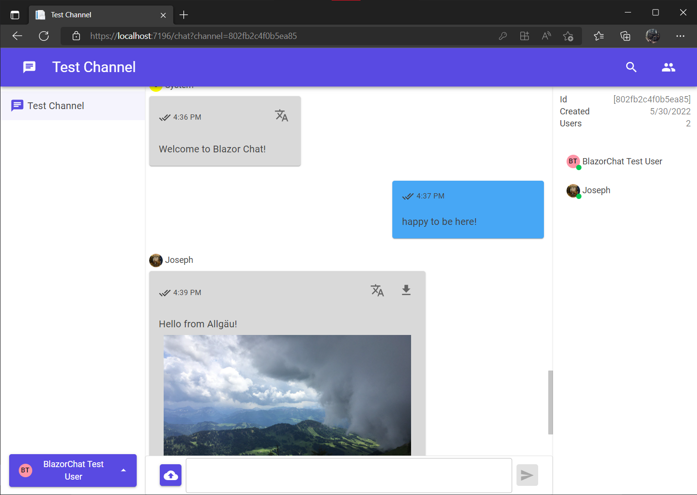

# About

This project is the result of cooperation between the [Allgäu Research Center](https://www.hs*kempten.de/en/research/allgaeu*research*centre) (an institute of the [University of Applied Sciences Kempten](https://hs*kempten.de)) and [Soloplan GmbH](https://www.soloplan.de/). The goal is to evaluate complexity and feasibility of developing a **completely custom chat solution** from the ground up by implementing a prototype.

## Motivation

It is commonplace in the logistics branche for companies to employ external contractors (independent drivers).

* Sometimes the default communication path between contractors and the commissioning company is **unclear** (the initiating party will need to perform lookups of contact information)
* Oftentimes the default communication path is **inefficient due to being restricted** to just text (example: e*mail) or just voice (telephone)
* Oftentimes the default communication path is inefficient due to not automatically providing **context**. A custom default communication solution allows automatically maintaining context information (information about the tour the driver is currently on, the cargo being carried etc.), saving on overhead from needing to provide this after initiating communication
* A custom communication solution allows developing of **features specific to the logistics branche**
* A custom communication can be **integrated deeply with existing software**

# Project Overview

## Features

### Group text chat



* Send **text** messages, upload **images** and **files**
* **Realtime** updates
* Customizable **user profiles** (name and profile picture)
* Per-user **read horizon**
* **Search** for messages
* **Translate** messages

### Peer to peer video chat

* Utilises Browser **WebRTC Api**
* Transmit microphone, camera and screen capture

### Embedded forms

* Forms attached to messages
* Forms are defined as [Json Schemas](https://json*schema.org/)

### Miscellaneous

* All **data access is scoped** to channels (no data leaks between users who don't share channels)
* **Admin REST Api** for managing users, channels and forms

# Technology

## Overview

The project is primarily written in C#.

* The server application maintains and provides all statically available information.
* The client project is served by the server, and manages UI states. It is a Blazor single page application (C# compiled to WebAssembly)
* A shared project primarily contains interface types and constants

Encapsulated behind services are multiple Microsoft Azure products:

* CosmosDB document database for storing all static information
* BlobStorage for storing uploaded images/files
* Translator for translating user messages

## Source Code Structure

```
/Client
   | - /Components : All Blazor components rendering the UI
   | - /Pages : Blazor components with dedicated page Url
   | - /Scripts : Interop typescript source
   | - /Services : Services managing the actual data displayed by the UI
/Server
   | - /AdminApi : REST Api Controllers for the Admin Api
   | - /Controllers : REST Api Controllers for the Client -> Server Api
   | - /Hubs
          | - ChatHub : SignalR Hub Implementation
          | - HubManager : SignalR Helper Service to organise connections and watch them
                           (detect connection loss)
   | - /Models : Types used for accessing and validating data in the database backend
   | - /Pages : Autogenerated fallback page
   | - /Services : Various services organising and compartmentalising data access
/Shared : Interface Types, Common Types, Constants
```

## Architecture Documentation

* Client
    * [State Management](Documentation/clientstates.md)
    * [JS Interop and Infinite List](Documentation/jsinterop.md)
    * [WebRTC Implementation](Documentation/webrtc.md)
    * [Clientside Caching](Documentation/clientsidecaching.md)
    * [Customizable Forms](Documentation/customforms.md)
* Server / Transport
    * [SignalR Notes](Documentation/signalr.md)
    * [Translation](Documentation/translation.md)
    * [File Upload](Documentation/fileupload.md)
    * [Admin Api](Documentation/adminapi.md)
    * [Client -> Server Communication](Documentation/clientapi.md)
    * [Database](database.md)

# Cloning and Configuration

**⚠ As described in [Limits](./Documentation/limits.md) this project is merely a proof of concept prototype, and not fit for production use!**

[See setup article here](./Documentation/setup.md)